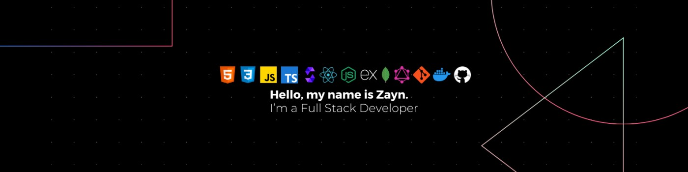

  

 

  
  
  
  

 

Software developer with over a year of experience building web applications from the ground up. I work across the full stack, from designing REST and GraphQL APIs to shipping polished front-end interfaces. Lately, most of my focus has been on Web3 and smart contract development.

I care a lot about code quality, clean architecture, and building things that actually hold up at scale. If something can be done in a simpler way, I will find it.

 

<h2 align="center">Technical Stack</h2>

  
   
  
   
  
   
  
   
  

 

<h2 align="center">GitHub Stats</h2>

  
  

  

 

  

